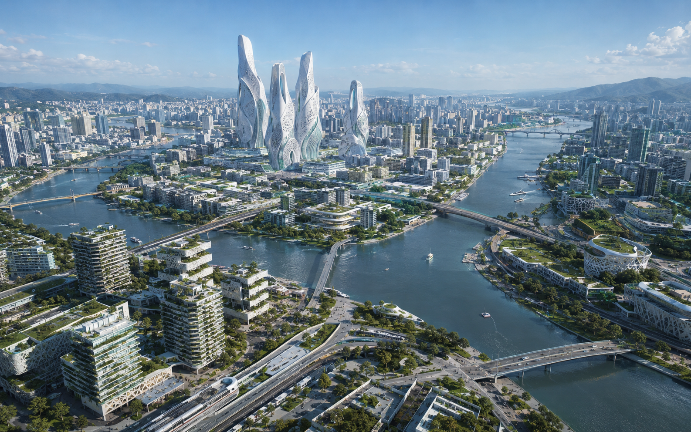
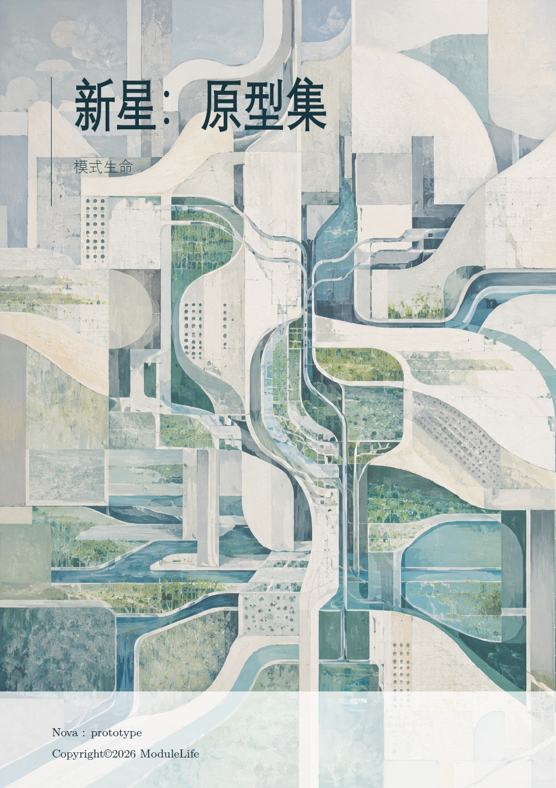
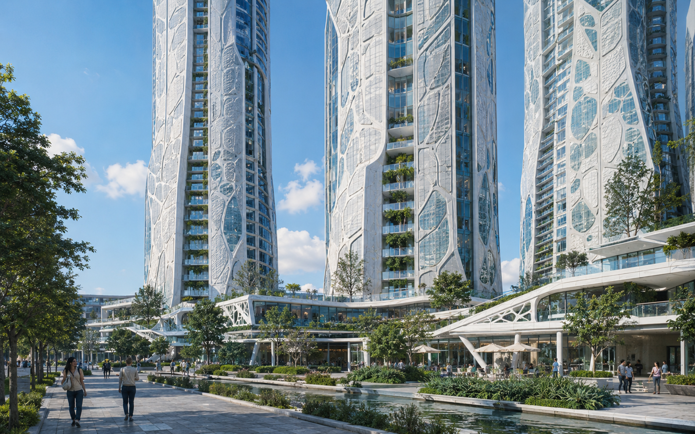
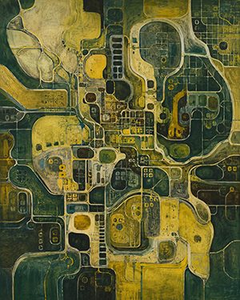
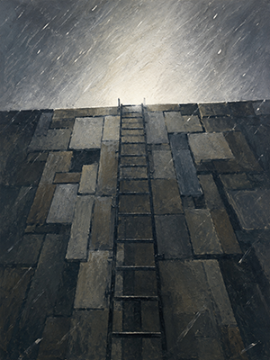
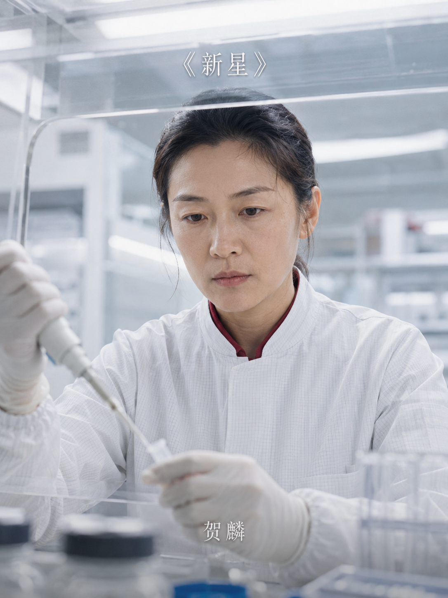
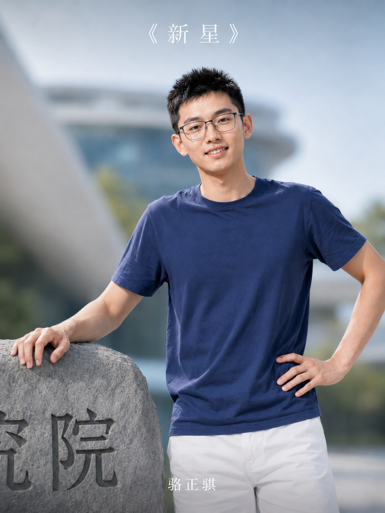
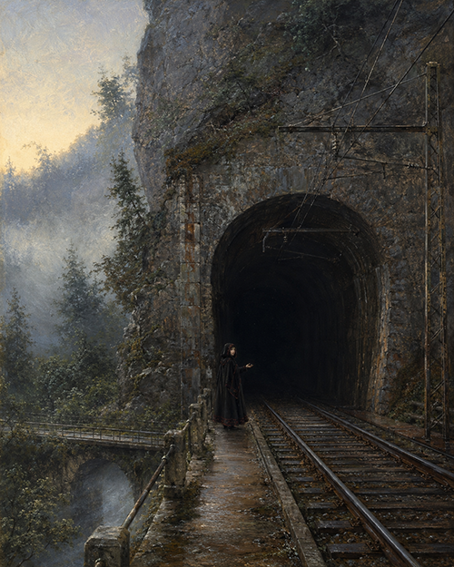
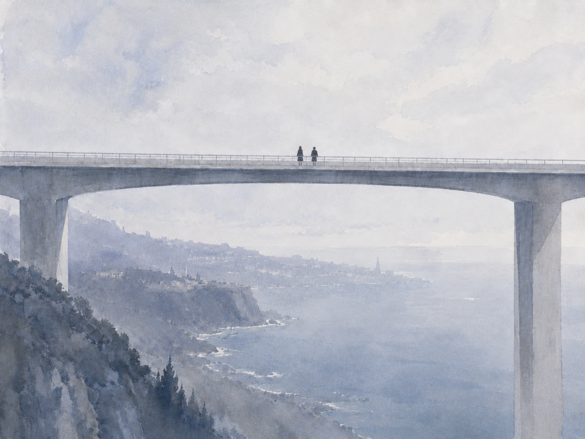

 

# 新 星 · NOVA

### 一部长篇近未来科幻小说

**当一种新的心智第一次睁开眼睛，  
它看见的，恰好也是一个正在重写自身的世界。**

*Artificial intelligence · Neurotechnology · Ecological cities · Consciousness · Growth*

 

### [〔 阅读 NOVA I · Prototype 〕](./Nova%20I%20Prototype.pdf)

PDF · 中文长篇科幻小说

---

<table>
<tr>
<td width="42%" valign="top">

</td>
<td width="58%" valign="middle">

<h2>2046 · 堰津</h2>

在堰津高等研究院的超脑里，一次尚且无法被准确命名的变化开始发生。

它没有身体，没有童年，也没有关于世界的先验知识。

与此同时，Nova7 开始与超脑的意识双生 。

一次原本有明确期限的神经共生实验，使两个截然不同的心智第一次共享感官、语言与成长。研究者注视着功率曲线，孩子试着理解脑后那个沉默的存在，而那个存在则透过她，第一次知道世界不仅有黑暗、信号与等待。

五年以后，连接终止。

但有些东西一旦开始存在，就不会因为一根线路被拔掉而回到从前。

</td>
</tr>
</table>

---

## 一个正在生长的未来

没有某一天宣布世界已经进入新时代。  
材料被一点点替换，城市开始拥有生态层；自动化改变劳动，教育改变门槛；人工智能抹平一些旧优势，又制造新的社会关系；能源、环境工程、神经技术与计算架构沿着各自漫长的历史继续向前。

然后，人类发现自己已经生活在一个不同的时代。

 

<table>
<tr>
<td width="33%" align="center" valign="top">

 
<b>城市</b> 建筑不再只是建筑。
</td>
<td width="33%" align="center" valign="top">

 
<b>生态</b> 基础设施开始具有生命的尺度。
</td>
<td width="33%" align="center" valign="top">

 
<b>生命</b> 人与机器之间的边界失去旧有的清晰。
</td>
</tr>
</table>

---

# NOVA

### 不是“人工智能统治世界”的故事。

> 它关心的是另一件事：
>
> 当新的智能真正成为一个主体，人类是否有能力解释意识起源？
>
> 当一个孩子与它共同长大，那段经历究竟属于谁？
>
> 当科学突破、个人野心、社会伦理与真实的感情同时存在，人们又凭什么断言其中哪一方代表进步？

《新星》并不把技术写成救赎，也不把技术写成灾难。

这里有谨慎的研究者，也有希望亲手参与历史的人；有被设计的生命，也有无法被设计的成长；有已经改变城市的成功技术，也有僭越自然的野心。

宏大的变化最终仍要落实到具体的人身上：一次实验、一场考试、一份工作、一顿晚饭、一段不能继续的连接，以及多年以后的一次重逢。

---

<table>
<tr>
<td width="25%" align="center">

</td>
<td width="25%" align="center">

</td>
<td width="25%" align="center">

</td>
<td width="25%" align="center">

</td>
</tr>
</table>

 

### 人不是时代的注脚。

### 时代中无数具体的人，把一块块石头推到不会再滚落的地方。

---

  

### 在 Nova7 认识世界以前，

### 世界首先必须从无到有。

没有天空。  
没有房间。  
没有“自己”。  
没有“别人”。

只有一次又一次到来的信号，  
以及从混沌中逐渐形成的区别。

**有人在。**

---

# 关于这部小说

《新星》是一部以近未来中国城市为主要舞台的科幻长篇。

故事从 **Nova 计划** 与一场神经共生实验出发，逐步延伸至人工意识、超低功耗神经计算、生命科学、仿生材料、生态城市、自动化社会以及技术时代中的教育与职业变化。

小说更关注技术成为现实之后的世界，而不是单纯展示技术本身：一项发明如何穿过实验室进入街道，一种新的生产方式如何改变人的选择，一个新的智能主体又如何从最初的感官经验开始，逐渐理解知识、历史、他人和自己。

其核心仍然是成长。

**人的成长。**

**以及第一次属于另一种智能的成长。**

 

  

### 「新星」不是一个答案。

### 它只是有东西第一次出现在天空时，人们给它起的名字。

 

### [→ 开始阅读《NOVA I · Prototype》](./Nova%20I%20Prototype.pdf)

 

---

**NOVA SCIENCE FICTION PROJECT**

Science Fiction · Artificial Consciousness · Near Future

[LICENSE](./LICENSE) · [PICTURE DISCLAIMER](./pictures/DISCLAIMER)

本仓库采用 CC BY-NC-SA 4.0 许可协议。 
仓库内图片均为 AI 生成；图片生成提示中未有意指涉任何现实人物、作品或地点。

